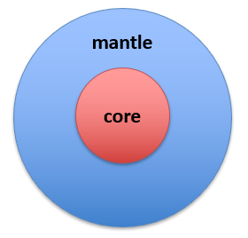

Tutorials
=========

Here, you will find a variety of tutorials.
Before proceeding, ensure that the SIR 3S Toolkit is properly installed (see :ref:`Installation <installing-toolkit-label>`). 

These tutorials are designed to introduce new users to the basic functionalities of the SIR 3S Toolkit. 

Each tutorial is available for **previewing** as a rendered notebook.

Each tutorials is available for **downloading**.

.. _Ttu1-49:

SIR3S_Model()
~~~~~~~~~~~~~

SIR3S_Model() implements basic functionalities regarding interactions between Python and a SIR 3S model.

You can also download all tutorials regarding SIR3S_Model (0 - 49) and their respective data in a joint `.zip` archive at once `here <https://github.com/3SConsult/sir3stoolkit/releases/download/tutorial_assets/Tutorials000-049_Assets.zip>`_.

.. _Ttu000:

Tutorial 0: Importing and initialization of the SIR 3S Toolkit
^^^^^^^^^^^^^^^^^^^^^^^^^^^^^^^^^^^^^^^^^^^^^^^^^^^^^^^^^^^^^^

This tutorial demonstrates how to import the SIR 3S Toolkit and initialize instances of its classes.

View: `Notebook <tutorials/SIR3S_Model/Tutorial000_Assets/ToolkitTutorial000.html>`_ | Download: `ZIP archive <https://github.com/3SConsult/sir3stoolkit/releases/download/tutorial_assets/Tutorial000_Assets.zip>`_.

.. _Ttu001:

Tutorial 1: Creating a new or opening an existing SIR 3S model
^^^^^^^^^^^^^^^^^^^^^^^^^^^^^^^^^^^^^^^^^^^^^^^^^^^^^^^^^^^^^^

This tutorial demonstrates how to create new SIR 3S models or open already existing ones.

View: `Notebook <tutorials/SIR3S_Model/Tutorial001_Assets/ToolkitTutorial001.html>`_ | Download: `ZIP archive <https://github.com/3SConsult/sir3stoolkit/releases/download/tutorial_assets/Tutorial001_Assets.zip>`_.

.. _Ttu002:

Tutorial 2: Accessing and modifying model data
^^^^^^^^^^^^^^^^^^^^^^^^^^^^^^^^^^^^^^^^^^^^^^

This tutorial demonstrates how to get and set values of objects based on their topological key (tk).

View: `Notebook <tutorials/SIR3S_Model/Tutorial002_Assets/ToolkitTutorial002.html>`_ | Download: `ZIP archive <https://github.com/3SConsult/sir3stoolkit/releases/download/tutorial_assets/Tutorial002_Assets.zip>`_.

.. _Ttu003:

Tutorial 3: Accessing calculation results
^^^^^^^^^^^^^^^^^^^^^^^^^^^^^^^^^^^^^^^^^

This tutorial demonstrates how to get result values of objects based on their tk.

View: `Notebook <tutorials/SIR3S_Model/Tutorial003_Assets/ToolkitTutorial003.html>`_ | Download: `ZIP archive <https://github.com/3SConsult/sir3stoolkit/releases/download/tutorial_assets/Tutorial003_Assets.zip>`_.

.. _Ttu004:

Tutorial 4: Editing a SIR 3S using Transactions/EditSessions
^^^^^^^^^^^^^^^^^^^^^^^^^^^^^^^^^^^^^^^^^^^^^^^^^^^^^^^^^^^^

This Tutorial demonstrates how to change SIR 3S models by grouping changes into Transactions/EditSessions.

View: `Notebook <tutorials/SIR3S_Model/Tutorial004_Assets/ToolkitTutorial004.html>`_ | Download: `ZIP archive <https://github.com/3SConsult/sir3stoolkit/releases/download/tutorial_assets/Tutorial004_Assets.zip>`_.

.. _Ttu005:

Tutorial 5: Insert and Connect Elements
^^^^^^^^^^^^^^^^^^^^^^^^^^^^^^^^^^^^^^^

This Tutorial demonstrates how new elements such as nodes, pipes, tanks, valves, etc. can be inserted into a SIR 3S model and connected.

View: `Notebook <tutorials/SIR3S_Model/Tutorial005_Assets/ToolkitTutorial005.html>`_ | Download: `ZIP archive <https://github.com/3SConsult/sir3stoolkit/releases/download/tutorial_assets/Tutorial005_Assets.zip>`_.

.. _Ttu006:

Tutorial 6: Tables
^^^^^^^^^^^^^^^^^^

This Tutorial demonstrates how to view SIR 3S tables in python and add rows to them. For time tables some more advanced features are available: :ref:`Tutorial 54 <_Ttu054>`

View: `Notebook <tutorials/SIR3S_Model/Tutorial006_Assets/ToolkitTutorial006.html>`_ | Download: `ZIP archive <https://github.com/3SConsult/sir3stoolkit/releases/download/tutorial_assets/Tutorial006_Assets.zip>`_.

.. _Ttu007:

Tutorial 7: Groups
^^^^^^^^^^^^^^^^^^

This Tutorial demonstrates how to obtain the tks of objects that are part of a Group (Layer) and to change which objects are part of which groups.

View: `Notebook <tutorials/SIR3S_Model/Tutorial007_Assets/ToolkitTutorial007.html>`_ | Download: `ZIP archive <https://github.com/3SConsult/sir3stoolkit/releases/download/tutorial_assets/Tutorial007_Assets.zip>`_.

.. _Ttu008:

Tutorial 8: Miscellaneous
^^^^^^^^^^^^^^^^^^^^^^^^^^

This Tutorial demonstrates miscellaneous functions of the SIR3S_Model() class that cannot be assigned to one of the previous Tutorial topics.

View: `Notebook <tutorials/SIR3S_Model/Tutorial008_Assets/ToolkitTutorial008.html>`_ | Download: `ZIP archive <https://github.com/3SConsult/sir3stoolkit/releases/download/tutorial_assets/Tutorial008_Assets.zip>`_.

.. _Ttu50-99:

SIR3S_Model_Mantle()
~~~~~~~~~~~~~~~~~~~~

SIR3S_Model_Mantle() is a collector class that extends the SIR3S_Model() class. As of now the model data for these tutorials is not publicly available (internal: T:\\SCRATCH\\Jablonski\\Toolkit).

.. _Ttu050:

Tutorial 50: Mantle Import
^^^^^^^^^^^^^^^^^^^^^^^^^^

View: `Notebook <tutorials/SIR3S_Model_Mantle/Tutorial050_Assets/ToolkitTutorial050.html>`_ | Download: :download:`Notebook <tutorials/SIR3S_Model_Mantle/Tutorial050_Assets/ToolkitTutorial050.ipynb>`.

.. _Ttu051:

Tutorial 51: Manual Creation of Element Dataframes
^^^^^^^^^^^^^^^^^^^^^^^^^^^^^^^^^^^^^^^^^^^^^^^^^^

This Example demonstrates the capabilities of the class SIR3S_Model_Dataframes that extends SIR3S_Model be abilities to work directley with pandas dataframes. It is shown how to create dataframes containing information about elements such as Nodes, Pipes, etc. existing in a SIR 3S Model. The methods presented are manual, user-defined and detailed. For creating more general dataframes with less input necessary, see Tutorial 52.   

View: `Notebook <tutorials/SIR3S_Model_Mantle/Tutorial051_Assets/ToolkitTutorial051.html>`_ | Download: :download:`Notebook <tutorials/SIR3S_Model_Mantle/Tutorial051_Assets/ToolkitTutorial051.ipynb>`.

.. _Ttu052:

Tutorial 52: General Creation of Element Dataframes
^^^^^^^^^^^^^^^^^^^^^^^^^^^^^^^^^^^^^^^^^^^^^^^^^^^

This Example demonstrates the capabilities of the class SIR3S_Model_Dataframes that extends SIR3S_Model be abilities to work directley with pandas dataframes. It is shown how to create dataframes containing information about elements such as Nodes, Pipes, etc. existing in a SIR 3S Model. The methods presented are not user-defined and neither efficient, but get you the most important information quickly. For more detailed methods of creating dataframes, see Tutorial 51.

View: `Notebook <tutorials/SIR3S_Model_Mantle/Tutorial052_Assets/ToolkitTutorial052.html>`_ | Download: :download:`Notebook <tutorials/SIR3S_Model_Mantle/Tutorial052_Assets/ToolkitTutorial052.ipynb>`.

.. _Ttu053:

Tutorial 53: Creation of  Non-Element Dataframes
^^^^^^^^^^^^^^^^^^^^^^^^^^^^^^^^^^^^^^^^^^^^^^^^

This Example demonstrates the capabilities of the class SIR3S_Model_Dataframes that extends SIR3S_Model be abilities to work directley with pandas dataframes. It is shown how to create dataframes containing information that does not concern individual elements types such as Nodes, Pipes, etc. but instead concerning more abstract SIR 3S data such as longitudinal sections or concatenations of multiple element types like hydraulic edges.

View: `Notebook <tutorials/SIR3S_Model_Mantle/Tutorial053_Assets/ToolkitTutorial053.html>`_ | Download: :download:`Notebook <tutorials/SIR3S_Model_Mantle/Tutorial053_Assets/ToolkitTutorial053.ipynb>`.

.. _Ttu054:

SIR3S_Advanced_Operations implements functions that extend the basic C# operations with more advanced operations to change a SIR 3S model.

Tutorial 54: Measured Variable Tables
^^^^^^^^^^^^^^^^^^^^^^^^^^^^^^^^^^^^^

This example demonstrates how view, create, delete and edit measured variable tables (Sollwerttabellen) with pandas dataframes as python representation. The functions presented work for any kind of time table.

View: `Notebook <tutorials/SIR3S_Model_Mantle/Tutorial054_Assets/ToolkitTutorial054.html>`_  | Download: :download:`Notebook <tutorials/SIR3S_Model_Mantle/Tutorial054_Assets/ToolkitTutorial054.ipynb>`.

.. _Ttu061:

Tutorial 61: Nx-Graph
^^^^^^^^^^^^^^^^^^^^^

This Tutorial demonstrates how to create a nx-Graph from a SIR 3S model.

View: `Notebook <tutorials/SIR3S_Model_Mantle/Tutorial061_Assets/ToolkitTutorial061.html>`_  | Download: :download:`Notebook <tutorials/SIR3S_Model_Mantle/Tutorial061_Assets/ToolkitTutorial061.ipynb>`.

.. _Ttu062:

Tutorial 62: Pandapipes
^^^^^^^^^^^^^^^^^^^^^^^

This Tutorial demonstrates how to create a pandapipes model from a SIR 3S model.

View: `Notebook <tutorials/SIR3S_Model_Mantle/Tutorial062_Assets/ToolkitTutorial062.html>`_  | Download: :download:`Notebook <tutorials/SIR3S_Model_Mantle/Tutorial062_Assets/ToolkitTutorial062.ipynb>`.

.. _Ttu071:

Tutorial 71: Time Curves
^^^^^^^^^^^^^^^^^^^^^^^^

This Tutorial demonstrates how to plot time curves.

View: `Notebook <tutorials/SIR3S_Model_Mantle/Tutorial071_Assets/ToolkitTutorial071.html>`_  | Download: :download:`Notebook <tutorials/SIR3S_Model_Mantle/Tutorial071_Assets/ToolkitTutorial071.ipynb>`.

.. _Ttu072:

Tutorial 72: Longitudinal Sections (soon)
^^^^^^^^^^^^^^^^^^^^^^^^^^^^^^^^^^^^^^^^^

This Tutorial demonstrates how to plot time curves. WORK IN PROGRESS

View: `Notebook <tutorials/SIR3S_Model_Mantle/Tutorial072_Assets/ToolkitTutorial072.html>`_  | Download: :download:`Notebook <tutorials/SIR3S_Model_Mantle/Tutorial072_Assets/ToolkitTutorial072.ipynb>`.

.. _Ttu073:

Tutorial 73: Network Color Depiction
^^^^^^^^^^^^^^^^^^^^^^^^^^^^^^^^^^^^

This example demonstrates how to plot network color depictions (ncd).

View: `Notebook <tutorials/SIR3S_Model_Mantle/Tutorial073_Assets/ToolkitTutorial073.html>`_  | Download: :download:`Notebook <tutorials/SIR3S_Model_Mantle/Tutorial073_Assets/ToolkitTutorial073.ipynb>`.

.. _Ttu081:

Tutorial 81: Groups
^^^^^^^^^^^^^^^^^^^

This example demonstrates how add, remove, set elements to groups.

View: `Notebook <tutorials/SIR3S_Model_Mantle/Tutorial081_Assets/ToolkitTutorial081.html>`_  | Download: :download:`Notebook <tutorials/SIR3S_Model_Mantle/Tutorial081_Assets/ToolkitTutorial081.ipynb>`.

..
   Examples
   --------

   These examples are intended for users who are already familiar with the basic functionality of the SIR 3S Toolkit and demonstrate how to apply it to real-world scenarios.

   Each example is available for both **viewing** and **downloading** as an `.ipynb` file. 

   .. _Tex1:

   Example 1: Shape Import
   ~~~~~~~~~~~~~~~~~~~~~~~

   This Example demonstrates how to create a connected topological network of nodes and pipes in SIR 3S via the SIR 3S Toolkit based on shapefile data. The data used comes from 'SIR 3S\Modelle\Beispiele\Wasser\Manual\Projektdaten\01 Shape-Dateien'.

   View: `Notebook <examples/Toolkit_Example001.html>`_ | Download: :download:`Notebook <examples/Toolkit_Example001.ipynb>`.

   .. _Tex2:

   .. Example 2: Iterate over SIR 3S calculations

   .. _TexX:

   Example X: Template
   ~~~~~~~~~~~~~~~~~~~

   .. admonition:: Contributor Template

      This is not a user-facing example but a template intended for contributors to create their own example.

   View: `Notebook <examples/Toolkit_ExampleX.html>`_ | Download: :download:`Notebook <examples/Toolkit_ExampleX.ipynb>`.

..
   Networks
   --------

   The networks are examples of SIR 3S model topologies.

   Each network is available for **previewing** and **downloading** as an `.py` file. You can open and run it using the Python Console in SIR 3S.

   .. _Tnw1:

   Network 1
   ^^^^^^^^^

   You can view the code below

   .. toggle::

      .. literalinclude:: Networks/Network1.py
         :language: python
         :linenos:

   You can download the Network file :download:`here <Networks/Network1.py>`.
